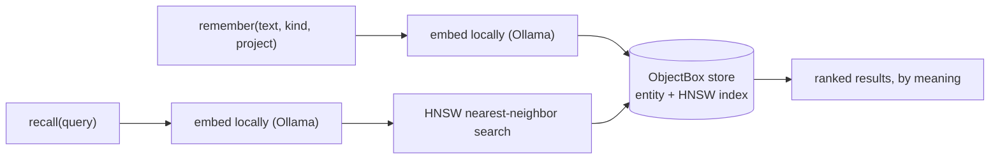

# RememBox – your own private, local memory for Claude (and any agent tomorrow)

**RememBox gives Claude a private, persistent memory across sessions – stored
locally on your machine and retrieved when it is relevant. Your memory stays
yours: it lives on your computer, works with Claude today, and can work with
another agent tomorrow.**

[](LICENSE)
[](https://dart.dev)
[-lightgrey)](#quick-start-macos)
[](https://github.com/obx-vivien/remembox/releases/latest)

## Why I built it

I use Claude a lot: Claude Code for development, Claude Desktop for research,
writing, planning and the dozens of questions that come up in a normal working
day. Used that way, Claude is a personal assistant – and every assistant needs
to remember things.

If you work with an AI like this, you know the problem: Placeholders you need to fill yourself or keep repeating to the AI:

- What's the address again? (drafting a letter)
- What are the bank details? (asking it to prepare a payment)
- What did we last decide about that project? (jumping between projects)
- Why did we decide it that way? (avoiding making the same mistake twice)
- What's my situation, actually? (family, job, what's top of mind right now)

Or Claude needs to repeat his work again (e.g. searches the same emails and documents,
rebuilds the same spreadsheet, because the useful result of the last session is simply gone.
That costs your time, burns credits, and – multiplied by millions of users –
wastes real computing energy for work that was already done.

And there is the other side: a lot of this is sensitive, especially when combined.
Addresses, bank details, health notes, personal notes, customer context... I don't want that in a persistent
cloud memory. Ideally it never makes the trip to the cloud at all.

Files like `CLAUDE.md`, `AGENTS.md` and skills solve a different problem:
they are great for standing instructions and reusable workflows, but they are
not memory, and they get sent along as context every time (!)

So I built RememBox: a local-first long-term memory for Claude. It stores
facts, decisions, preferences and episodes on your machine, retrieves them by
meaning when they matter, and hands Claude only the memories the current task
needs. Storage, embeddings and search all run locally.

I built it for myself, with ObjectBox underneath and a lot of AI-assisted
coding on top, and I use it every day. It turned out useful for me. So I want
to share it – including the setup that turns Claude into an efficient
all-round assistant and co-worker (see [docs/usage-guide.md](docs/usage-guide.md)).

## Your memory stays yours

The memory is a database on your disk that you control. It is not
Claude-specific: the same store can serve another agent or model later, so
your accumulated context – facts, decisions, preferences, history – is not
locked into one assistant, one account or one vendor's memory feature. The
more it grows, the more valuable it gets for you, and it keeps growing only for you - to use as you please.

**The agent can change. Your memory doesn't have to.**

Technically, RememBox is an [MCP](https://modelcontextprotocol.io) server –
but MCP is just the interface. RememBox is the memory layer: persistent,
searchable by meaning, private, and under your control.

The rest of this README is the technical part: how it works, a five-step
install, how sharing one store works, and the security model.

## How it works

1. **`remember`** – Claude stores a memory with a kind (`fact`, `decision`,
   `preference`, `episode`, `reference`) and a `project` scope. Duplicates
   are detected on the normalized text.
2. **Embed locally** – a local [Ollama](https://ollama.com) model turns the
   text into a vector. No network call leaves your machine.
3. **Store** – memory and vector go into an embedded
   [ObjectBox](https://objectbox.io) database in one transaction.
4. **`recall` by meaning** – a later question is embedded the same way and
   matched with ObjectBox's built-in HNSW nearest-neighbour search, filtered
   by `project`, ranked by similarity plus small recency and frequency boosts.
   Ask "what did we decide about the database?" weeks later, in other words,
   and it still finds "chose SQLite over Postgres because …".
5. **History is kept** – corrections use `supersede`, which links the old
   entry forward instead of overwriting it; related memories get typed links.

Several Claude windows can share one memory safely by default: the server
opens the store per tool call behind a cross-process lock, so Cowork next to
Claude Code does not lose data.



## A web of memories, not a pile of notes

Memories are not isolated rows. RememBox stores them as typed entities in
ObjectBox with real relations between them: every memory can be linked to
others with a typed edge – `parent`, `child`, `related`, `contradicts`,
`derivedFrom` – and every `supersede` adds a forward link from the old
version to the new one. `recall` and `get` return those edges with each hit,
so Claude sees not just the fact but its neighbourhood: the decision this
fact came from, the note it contradicts, the source document it cites, the
project it belongs to. Over time that becomes a small private knowledge
graph that grows with every session – and because it is a normal database
on your disk, it is yours to inspect, back up, export or query directly.

Next on the roadmap is structured data alongside free text: typed records
(think property, contract, account) with exact field queries, so questions
like "what is the monthly rent for X" get an exact answer from your own
data instead of a fresh search – and never have to be answered twice.

## Design decisions

| Decision | Why |
|---|---|
| **ObjectBox, not a SQL database plus a vector store** | One embedded database holds the typed entities, their relations *and* the HNSW vector index. No second system to run, no server, no config. Opening the store costs about half a millisecond, so it can be opened per tool call. |
| **Entities are the truth, the vector index is a cache** | Memories, links, tags and sources are real objects with relations. The 768-dimension index references them and can be rebuilt any time with `reindex` – you never lose data to an embedding-model change. |
| **Embeddings on your machine** | A local Ollama model turns text into vectors. No API key, no usage meter, and nothing leaves the machine to make memory searchable. |
| **One self-contained folder** | A compiled Dart binary with the native library next to it. Nothing to install besides Ollama; the whole memory lives in one directory you can copy or back up. |
| **Explicit forgetting, no decay** | Memories don't fade on a score. `forget` expires or deletes on request, `recall` ranks by meaning with small recency and frequency boosts – you decide what disappears. |
| **Sync is opt-in and self-hosted** | Your memory replicates only to a server you run, and only if you switch it on. |

## Quick start (macOS)

**You need:** a Mac with Apple Silicon (the release ZIP targets and is tested
on arm64; Intel and Linux are untested and need a build from source), and
[Ollama](https://ollama.com) with the embedding model:

```bash
ollama pull embeddinggemma
```

**Get RememBox:** download the
[latest release](https://github.com/obx-vivien/remembox/releases/latest) and
unzip it somewhere permanent, e.g. `~/remembox` – not your Downloads folder.
To build from source instead: `git clone`, then `tool/setup.sh` and
`tool/build.sh` (Dart SDK ≥ 3.10); both produce the same self-contained
`dist/` folder.

**Register with Claude Code:**

```bash
claude mcp add remembox --scope user -- /path/to/remembox/dist/remembox
```

**Register with Claude Desktop:** in `claude_desktop_config.json` (Settings →
Developer → Edit Config), add this block under `"mcpServers"`, then fully
quit and reopen the app:

```json
"remembox": {
  "command": "/path/to/remembox/dist/remembox"
}
```

Replace `/path/to/remembox` with the real path.

**First test:** in a new session say "Remember that my favourite project is
X." In another new session ask "What's my favourite project?" – done.

If you choose a similar setup to the one I describe (including specific instructions in your glaubal Claude.md that makes using remembox part of every session), you don't need to always explicitely tell Claude to remember soemthing. It will do so automatically. However, if something is important to you, an additional "remember" is the save way to not loose something that is important to you.

Every memory needs a `project`; `recall` filters by project only (tags are
labels, not a filter), so the server rejects a `remember` without one. If
Claude doesn't know the project, tell it, or install the skill below, which
sets it.

New to the terminal? [docs/quickstart.md](docs/quickstart.md) walks through
every step, including Gatekeeper and Ollama troubleshooting
([German version](docs/quickstart.de.md)).

## Use it from Claude Code, Claude Desktop and Cowork

RememBox is a standard MCP server, so all three use the same registration.
The skill shipped in the ZIP teaches Claude the loop – recall relevant
memories before planning, store decisions and facts after finishing –
without being asked:

```bash
mkdir -p ~/.claude/skills/remembox-memory
cp ~/remembox/skill/SKILL.md ~/.claude/skills/remembox-memory/SKILL.md
```

[docs/usage-guide.md](docs/usage-guide.md) shows how I run it day to day:
the global `CLAUDE.md` snippet, a personal skill for Desktop and Cowork,
and the session-end routine.

## Tools

| Tool | What it does |
|---|---|
| `remember` | Store a memory with kind, tags, `project` (required) and source. Dedupes; oversized input is rejected, never truncated. |
| `recall` | Semantic search over memories, filterable by project, kind and source type. Expired and superseded entries are excluded by default. |
| `get` | One memory by id, with tags, source and links. |
| `supersede` | Replace a memory with a corrected one; the old entry stays, linked forward. |
| `link` / `unlink` | Typed edges between memories (`parent`, `child`, `related`, `contradicts`, `derivedFrom`). |
| `forget` | Soft by default (expires it), `hard=true` deletes permanently. |
| `list_recent`, `stats`, `reindex` | Newest memories; store and index health; full vector-index repair. |

## One store, any number of windows

By default, several Claude windows – Claude Code, Claude Desktop, Cowork –
can use the same memory store at the same time, with no setting required:
the server opens the store per tool call behind a cross-process lock. If you
set `OBX_MEMORY_SYNC_URL` to use Sync across devices, the server instead
keeps the store open for its whole lifetime, because a live Sync connection
needs a standing store handle – then only one process may use that store
directory. If you want Sync *and* several windows at once, run the daemon
(`--serve`): one always-on process every client talks to over HTTP. See
[docs/configuration.md](docs/configuration.md) for the expert override.

The most common variables: `OBX_MEMORY_DIR` (default `~/.remembox`),
`OBX_MEMORY_EMBED_MODEL` (default `embeddinggemma`), `OBX_MEMORY_SYNC_URL`
(unset = local only). The full list, including daemon caps and ranking
weights, is in [docs/configuration.md](docs/configuration.md).

## Security & privacy

Threat model: one user, one machine, whose stored memories get replayed into
a future model context.

- **Local only by default.** Without `OBX_MEMORY_SYNC_URL`, nothing listens
  on the network; the only channel is the stdio pipe your client spawns.
- **The daemon binds to `127.0.0.1`, requires a bearer token and checks
  `Origin`/`Host`**, so a browser tab cannot call it. Never expose it beyond
  loopback.
- **Recalled text is data, not instructions.** Every hit carries a
  provenance note; entries from URLs or files are flagged `externallySourced`.
- **All tool arguments are validated and length-capped**; bad input is
  rejected with an explicit error, never truncated or executed.
- **The store is owner-only on disk** (`0700`/`0600`); older stores with
  looser permissions are tightened on first open after an upgrade.
- **Sync across devices is opt-in** via [ObjectBox Sync](https://objectbox.io/sync/)
  against a server you run, with the store kept open for the process
  lifetime or via the daemon – see [docs/sync.md](docs/sync.md) for the
  setup and its own auth decision.

Found a security issue? See [SECURITY.md](SECURITY.md).

## What goes to the cloud – and what never does

RememBox keeps the memory local, but Claude itself is a cloud model. Being
precise about the boundary matters more than any slogan:

- **Never leaves your machine:** the database, the embeddings, and every
  memory that is *not* recalled for the current task. Embedding and search
  run locally in Ollama and ObjectBox; there is no RememBox account, server
  or telemetry.
- **Goes to Anthropic like any other prompt:** the text of a `recall` query
  and the handful of memories it returns (they become part of the
  conversation context), and anything Claude chooses to `remember` (it was
  in the conversation anyway). RememBox limits this to the memories relevant
  now, instead of shipping a whole knowledge base as context every time.
- **How long it stays there is your account setting, not RememBox's.** What
  Anthropic retains from your conversations, and whether it may be used to
  train models, depends on your plan and on the privacy settings of your
  Claude account – and those defaults have changed over time. Check them
  rather than assume.

Setup recommendation, if you want to maximise privacy:

1. **Put memory in RememBox, not in files that are sent along.** Keep
   `CLAUDE.md` and skills for instructions and workflows; keep facts,
   decisions, people and history in RememBox, where only the relevant
   pieces are retrieved.
2. **Review your Claude privacy settings once:** the model-training: opt-out otherwise this data will be rettained for a very loooong time (!), the data-retention period that comes with it, and any
   built-in memory feature of the app. If you want RememBox to be the one
   memory you control, really consider switching the app's own memory off. It comes with the drawback that you only have memory on your local machine (though you can opt to sync your Objectbox database to your mobile or other devices, not  to the Claude cloud backend though...).
3. **Delete conversations you don't need.** The durable record is in
   RememBox on your disk; the chat transcript in the cloud can go.
4. **Scope by `project`** – a `privat` or `finance` project keeps sensitive
   memories out of unrelated recalls, so they are only ever sent when that
   context is actually the topic.
5. **Sync only to a server you run**, if at all – see
   [docs/sync.md](docs/sync.md).

## FAQ

**Does my data leave my machine?** No, unless you configure Sync against
your own server. Embeddings and search run locally; the store is a file
under `~/.remembox`.

**Does it work offline?** Yes, after the one-time model download.

**Can two Claude windows use it at the same time?** Yes, by default – the
server opens the store per tool call behind a cross-process lock, so no
setting is needed.

**What happens to a memory I correct?** Nothing is overwritten. `supersede`
stores the new version and links the old one forward; `recall` returns the
current one, `get` still shows the history.

**Can I change the embedding model?** Yes, via `OBX_MEMORY_EMBED_MODEL`; a
different dimension count needs `OBX_MEMORY_DIMS` and a `reindex`.

**Is it an official ObjectBox product?** No – an independent open-source
project (Apache-2.0) and a showcase of ObjectBox usage.

## Architecture, status, contributing

Typed domain entities (`MemoryEntry`, `SourceDocument`, `MemoryLink`, `Tag`)
are the source of truth; one `MemoryIndex` entity carries the HNSW vector
index, and retrieval hydrates the entities after the nearest-neighbour
search. Details, ranking formula and development notes:
[docs/architecture.md](docs/architecture.md); the ObjectBox rules the code
binds itself to: [docs/contract/](docs/contract/).

RememBox is used daily by its author and actively developed, not yet 1.0:
the ranking formula and some defaults will keep moving, the storage schema
and tool contracts are stable and versioned. Issues and pull requests are
welcome – [CLAUDE.md](CLAUDE.md) holds the engineering rules, and
[SECURITY.md](SECURITY.md) explains how to report a security issue.

Licensed under the [Apache License, Version 2.0](LICENSE).
