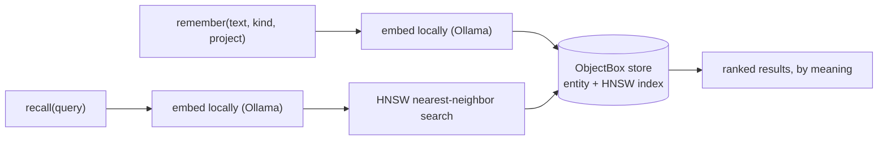

# RememBox – long-term memory for your AI, owned by you

**Give your AI a long-term memory that you own and can take with you. RememBox keeps it locally on your machine, works with Claude today, and can be used by other compatible AI assistants tomorrow.**

Works with Claude Code, Claude Desktop and Cowork via MCP. Built on ObjectBox with local embeddings and semantic search. 👉 **[Start using it now (Quick start)](#quick-start-macos-apple-silicon)**

[](https://github.com/obx-vivien/remembox/actions/workflows/ci.yml)
[](LICENSE)
[](https://dart.dev)
[-lightgrey)](#quick-start-macos-apple-silicon)
[](https://github.com/obx-vivien/remembox/releases/latest)

**Jump to:** [What it remembers](#what-should-an-ai-assistant-remember) · [Memory vs. files](#why-not-just-a-markdown-file) · [The full setup](#more-than-memory-giving-your-ai-continuity) · [Privacy](#private-by-default) · [Technical details](#technical-details)

---

RememBox is an open-source, local long-term memory for AI assistants that lets users keep and reuse their personal context across sessions and AI providers. It currently integrates with Claude via MCP and uses ObjectBox for local storage and vector search.

## Your AI should not start from zero every session

If you use an AI assistant regularly, you build up something valuable together: **context**. Who you are and how you work, the facts you keep needing, what is going on in your life, what you decided and why, what you already tried.

Much of that disappears when a session ends – or stays inside one provider's memory system. So you repeat yourself: What's my company address again? Which account should this letter refer to? Why did we rule out the other option? Didn't we already try that? Or the AI repeats work it has already done: searching the same emails, rebuilding the same overview, rediscovering the same constraints.

RememBox keeps the parts worth carrying forward **outside the AI provider, under your control**. Not every message, not the whole transcript – the useful memory of working together. If every conversation you have with AI is independent, you probably do not need it.

## What should an AI assistant remember?

Often, surprisingly ordinary things:

| Area | Examples |
|---|---|
| **Practical details** | Addresses, the bank accounts you use for different purposes, contract and account information |
| **People and living context** | Partner, children, pets, family situation, recurring responsibilities |
| **Health context** | Conditions, limitations or goals that should change the advice you get |
| **Goals and preferences** | What you are working toward; how you like to travel, write, work and decide |
| **Projects and situations** | The background of a work project, a move, an insurance claim, a renovation, a trip |
| **Decisions and reasoning** | What you decided – and, just as importantly, why |
| **Experience and lessons** | What you tried, what worked, what failed, what should not be repeated |
| **Useful results** | Conclusions from earlier research, documents and conversations |

So when you ask *"Can you draft the letter?"*, the assistant already knows which address belongs in it. When you come back weeks later with *"Where did we leave this?"*, it recovers the previous decisions, dead ends and reasoning. The point is not to make an AI remember everything – it is to let it remember **the things a good long-term assistant would already know**.

## Why not just a Markdown file?

For a handful of stable facts, a Markdown file is exactly the right tool. The problem starts when one file has to be profile, current status, history, knowledge base and memory at the same time. A fact sheet can say *"Flat B: Example Street 24, 3 rooms"*. Real continuity is more than that:

> We originally preferred flat A because of the garden, but after the second viewing we ruled it out because the commute would be too long.

> We first tried settling the claim with the insurer directly. They rejected it, so the next step was the assessor's report.

Those are **episodes, decisions and changing context**. And a growing profile file gets sent along whole with every cloud session – including addresses, bank details and health context the current task does not need. RememBox keeps the durable memory local, searches locally, and returns only what is relevant now.

## More than memory: giving your AI continuity

A really useful assistant needs to answer three different questions, and they belong in three different places:

| Layer | Question | Good place | Examples |
|---|---|---|---|
| **Now** | What is going on right now? | A small local `cockpit.md` | Active projects, a move, an insurance claim, deadlines, next actions |
| **Memory** | What should the assistant know and remember over time? | RememBox | Addresses, bank details, family and health context, goals, preferences, decisions, previous attempts |
| **Rules** | How should the assistant work with me? | `CLAUDE.md` in Claude Code; a personal skill in Desktop and Cowork | Recall before answering, keep memory current, maintain the cockpit, supersede outdated facts |

One rule cuts across all three: **sensitive personal values belong in RememBox, not in `CLAUDE.md`, skills or other standing prompt files.** Those describe *how to work*; the private values stay in the local memory layer.

The cockpit is a living dashboard, a few lines per topic, overwritten as things change:

```text
HOME
- Moving: comparing two apartments
  Next: decide after Saturday's second viewing
```

Behind each line is a much larger body of context – the apartments, the trade-offs, what has already been tried – and that is what RememBox holds. Every memory belongs to a **project or topic** (`personal`, `finance`, `moving`, a work project), and recall searches within that scope, so unrelated parts of your life stay out of the current conversation.

The rules turn this into a habit the assistant keeps on its own: recall before substantive work, capture decisions and dead ends while working, store conclusions and update the cockpit afterwards. The supplied skill contains the basic loop; the [usage guide](docs/usage-guide.md) has the complete system and the daily practice I use.

## What it feels like in practice

On Monday you compare two apartments for a possible move; the addresses, trade-offs and open next step become part of its RememBox memory. Later that week a positioning decision on a business project is stored with its reasoning. Then an insurance claim: the next action goes into the cockpit, the case history into RememBox.

Weeks later, in a fresh session: *"What do I currently need to take care of?"* – the cockpit answers. *"Why had we ruled out the first apartment again?"* – RememBox retrieves the decision and its reasoning. *"Draft the follow-up to the insurer."* – the assistant already has the claim history and the practical details.

Different questions need different kinds of continuity; a small current-state file, long-term memory and standing rules give the assistant all three.

## RememBox is not "chat with your documents"

Documents are sources; they tell an assistant what a file says. RememBox remembers **what you and your assistant learned, decided and established while working together**. A document may contain 80 pages; the durable memory might simply be *"Contract X renews automatically on 31 March unless cancelled three months earlier."* Later, the assistant retrieves that conclusion without re-reading the contract.

## Private by default

Addresses, finances, health, family and customer history may each be ordinary; put together they form a detailed picture of your life. RememBox therefore keeps the memory layer local: database, embeddings and search stay on your machine, there is no RememBox account or telemetry, and cross-device Sync goes only to a server you configure.

One boundary matters: **the AI you use may still be a cloud service.** When Claude recalls a memory, that returned text becomes part of the conversation and is sent to Anthropic like other prompt content. The privacy claim is selective disclosure, not "Claude never sees your memory": **your complete accumulated memory does not have to live in the provider's cloud or be sent as standing context every time.** Details: [What goes to the cloud](#what-goes-to-the-cloud--and-what-never-does).

## Your memory stays yours – even if your AI changes

Provider memory is convenient, but the more useful it becomes, the harder it is to leave. RememBox separates **the memory** from **the model using it**: the database lives on your disk and is exposed through [MCP](https://modelcontextprotocol.io), a standard interface between AI applications and tools. I use it with Claude Code, Claude Desktop and Cowork today; another compatible AI can use the same accumulated context later.

**The AI is replaceable. Your memory is an asset you keep.**

## Why I built it

I use Claude a lot: Claude Code for development, Claude Desktop and Cowork for research, writing, planning and the dozens of questions of a normal day. Used that way, Claude behaves like an assistant or co-worker – and a good assistant should not need to be briefed from scratch every morning.

I did not want that accumulated memory to belong to one AI provider, and I did not want one giant profile file shipped as context over and over again. So I built RememBox: a local long-term memory layer plus a simple practice for keeping current state, history and rules in the right places. Built for myself, with [ObjectBox](https://objectbox.io/) underneath and a lot of AI-assisted coding on top; I use it every day.

## How RememBox itself works – the simple version

1. **Something worth keeping comes up** – a fact, decision, preference, lesson or reference.
2. **RememBox stores it locally**, together with what is needed to search it.
3. **A later session asks** for memories relevant to the current topic.
4. **RememBox searches by meaning** – "why did we reject that option?" finds the decision even if it was phrased differently.
5. **Only the relevant memories are returned**, not your whole history.
6. **The history evolves** – memories are corrected, superseded and linked, never silently overwritten.

Implementation details: [Technical details](#technical-details).

## A web of memories, not a pile of notes

Memories relate to each other: a decision points to the research behind it, a correction replaces an old fact without deleting the history, a failed attempt stays attached to its project so another session does not repeat it. Over time RememBox becomes a small private knowledge graph – a normal database on your disk, yours to inspect, back up, export or query.

**Next on the roadmap:** structured personal data alongside free-form memories – typed records such as a property, contract or account with exact field queries, so *"What is the monthly rent for X?"* returns the stored value instead of re-reading the contract.

---

## Quick start (macOS, Apple Silicon)

The current prebuilt release targets macOS on Apple Silicon.

### 1. Install Ollama

Install [Ollama](https://ollama.com) and download the local embedding model:

```bash
ollama pull embeddinggemma
```

### 2. Download RememBox

Download the [latest release](https://github.com/obx-vivien/remembox/releases/latest) and unzip it somewhere permanent, for example:

```text
~/remembox
```

Do not leave it in the Downloads folder.

If macOS refuses to open it because it is from an "unidentified developer", clear the quarantine flag once for the whole folder:

```bash
xattr -dr com.apple.quarantine ~/remembox
```

### 3. Connect it to Claude

You can use the same memory from Claude Code, Claude Desktop, or both.

#### Claude Code

Run:

```bash
claude mcp add remembox --scope user -- ~/remembox/dist/remembox
```

#### Claude Desktop / Cowork

Open `claude_desktop_config.json` via:

**Settings → Developer → Edit Config**

Add this block under `"mcpServers"`, using the full path rather than `~`:

```json
"remembox": {
  "command": "/path/to/remembox/dist/remembox"
}
```

Then fully quit and reopen Claude Desktop.

### 4. Test it

In a new session, say:

> Remember that my favourite project is X.

Then open another new session and ask:

> What's my favourite project?

That's it.

Every memory needs a `project` so memories stay scoped to the right topic. If Claude does not know the project, tell it – or install the RememBox skill below, which teaches Claude the normal recall / remember workflow.

New to the terminal? [docs/quickstart.md](docs/quickstart.md) walks through every step, including Gatekeeper and Ollama troubleshooting. There is also a [German version](docs/quickstart.de.md).

### Other platforms: build from source

Intel Macs and Linux are currently untested. The launcher and library loading are intended to support them, so building from source is the way to try.

With Dart SDK ≥ 3.10 installed:

```bash
git clone https://github.com/obx-vivien/remembox.git
cd remembox
tool/setup.sh   # dependencies + ObjectBox library + code generation
tool/build.sh   # produces the same self-contained dist/ folder
```

Then register `dist/remembox` exactly as in step 3 above.

## Make it part of the assistant's normal workflow

Installing RememBox gives the AI access to persistent memory.

The supplied skill turns that access into a **memory practice**: the assistant is instructed to recall context proactively and keep the memory current as part of normal work, without waiting for you to say "remember this" every time.

Install it with:

```bash
mkdir -p ~/.claude/skills/remembox-memory
cp ~/remembox/skill/SKILL.md ~/.claude/skills/remembox-memory/SKILL.md
```

That installs it for Claude Code, where the same principles can also live in a global `CLAUDE.md`. In Claude Desktop and Cowork, add the same file as a personal skill through the app's skill settings – those surfaces do not read `CLAUDE.md`.

The important rules are simple:

- **Recall first** when previous context could change the answer.
- **Scope memories by `project` or topic** so unrelated context stays separate.
- **Remember durable conclusions**, not whole transcripts.
- **Store decisions with reasoning** as `decision` entries.
- **Remember dead ends** as `episode` entries so they are not rediscovered.
- **Add dated status snapshots** as `fact` entries tagged `status` when a project reaches a meaningful new state.
- **Supersede stale facts** instead of accumulating contradictions.
- **Link related memories** when the relationship is useful later.
- **Keep the cockpit current** when a topic's status or next action changes.
- **Keep sensitive values in RememBox**, not in `CLAUDE.md` or Skills.
- **Keep rules, current operational state and durable knowledge separate** so each has one clear source of truth.

The [usage guide](docs/usage-guide.md) contains the concrete setup, including the global `CLAUDE.md` snippet, the personal skill for Desktop and Cowork, the cockpit pattern and the session-end routine.

---

<a id="technical-details"></a>
# Technical details

Everything below is the implementation and operational side of RememBox. You do not need to understand it to understand the product, but it is intentionally documented here for people who want to know exactly how the memory works.

## Technical architecture

Technically, RememBox is an [MCP](https://modelcontextprotocol.io) server backed by [ObjectBox](https://objectbox.io/).

MCP is the interface. ObjectBox is the embedded database and vector-search engine. RememBox is the memory layer built on top.

### The memory path

1. **`remember`** – Claude stores a memory with a kind (`fact`, `decision`, `preference`, `episode`, `reference`) and a required `project` scope. Duplicates are detected on normalized text.
2. **Embed locally** – a local [Ollama](https://ollama.com) model turns the text into a vector. No remote embedding API is used.
3. **Store** – memory and vector go into an embedded ObjectBox database in one transaction.
4. **`recall` by meaning** – a later query is embedded the same way and matched using ObjectBox's built-in HNSW nearest-neighbour search, filtered by project and ranked by semantic similarity with small recency and frequency boosts.
5. **Keep history** – corrections use `supersede`, which links the old entry forward instead of overwriting it. Related memories can use typed links.



### Memory relationships

Memories are stored as typed entities, not isolated text rows.

Every memory can be linked to others with typed relationships:

- `parent`
- `child`
- `related`
- `contradicts`
- `derivedFrom`

Every `supersede` also adds a forward link from the old version to the new one.

`recall` and `get` return those relationships with a hit, so the assistant can receive not only a fact but relevant context around it: the decision it came from, a note it contradicts, its source, or related project history.

## Design decisions

| Decision | Why |
|---|---|
| **ObjectBox instead of a SQL database plus a separate vector store** | One embedded database holds the typed entities, their relations and the HNSW vector index. No second system needs to run. |
| **Entities are the truth; the vector index is rebuildable** | Memories, links, tags and sources are real objects. The vector index references them and can be rebuilt with `reindex`, so an embedding-model change does not redefine the underlying memory. |
| **Embeddings run locally** | Ollama turns text into vectors on the user's machine. No embedding API key, remote embedding request or usage meter is required. |
| **One self-contained folder** | The compiled Dart binary and native library live together. Apart from Ollama, there is no separate database server to install. |
| **Explicit forgetting, no automatic decay** | Memories do not disappear because an opaque score fell below a threshold. `forget` expires or deletes them explicitly; ranking uses meaning plus small recency and frequency boosts. |
| **Sync is opt-in and self-hosted** | The memory replicates only if Sync is explicitly configured, and only to the configured server. |

## Tools

| Tool | What it does |
|---|---|
| `remember` | Store a memory with kind, tags, required `project` and source. Deduplicates; oversized input is rejected rather than truncated. |
| `recall` | Semantic search over memories, filterable by project, kind and source type. Expired and superseded entries are excluded by default. |
| `get` | Retrieve one memory by ID, including tags, source and links. |
| `supersede` | Replace a memory with a corrected version while preserving and linking the old one. |
| `link` / `unlink` | Create or remove typed relationships between memories. |
| `forget` | Soft-forget by default; `hard=true` deletes permanently. |
| `list_recent` | Show recent memories. |
| `stats` | Inspect store and index health. |
| `reindex` | Rebuild the vector index. |

## Project scope

Every stored memory requires a `project`.

This is the technical mechanism behind the user-facing topic scopes described above. Project scope is the main way RememBox prevents unrelated memories from bleeding into each other's searches.

`recall` can filter by:

- `project`
- `kind`
- `sourceType`

Tags are labels, not a recall filter.

The supplied skill teaches Claude to set project names consistently. The server also validates this itself so the rule does not depend only on prompt compliance.

## One store, multiple Claude windows

By default, several Claude windows – Claude Code, Claude Desktop and Cowork – can use the same memory store at the same time.

In the default local mode, the server opens the store per tool call behind a cross-process lock rather than keeping the database open for the lifetime of a Claude session.

If `OBX_MEMORY_SYNC_URL` is configured, the server instead keeps the store open because a live Sync connection needs a standing store handle. In that mode, only one process may use the store directory directly.

If you need both Sync and several clients at once, run RememBox as a daemon with:

```text
--serve
```

One always-on process owns the store and clients talk to it over local HTTP.

See [docs/configuration.md](docs/configuration.md) for the expert options.

Common variables include:

- `OBX_MEMORY_DIR` – default `~/.remembox`
- `OBX_MEMORY_EMBED_MODEL` – default `embeddinggemma`
- `OBX_MEMORY_SYNC_URL` – unset means local only

The full configuration, including daemon caps and ranking weights, is documented in [docs/configuration.md](docs/configuration.md).

## Security model

Threat model: one user, one machine, with stored memories potentially replayed into a future model context.

- **Local only by default.** Without `OBX_MEMORY_SYNC_URL`, nothing listens on the network; the normal channel is the stdio pipe spawned by the client.
- **The daemon binds to `127.0.0.1`.** It requires a bearer token and checks `Origin` / `Host`. Do not expose it beyond loopback.
- **Recalled text is data, not instructions.** Every hit carries provenance information; entries originating in URLs or files are marked `externallySourced`.
- **Tool arguments are validated and length-capped.** Bad input is rejected explicitly rather than truncated or executed.
- **The store is owner-only on disk** (`0700` / `0600`). Older stores with looser permissions are tightened on first open after an upgrade.
- **Cross-device Sync is opt-in** via [ObjectBox Sync](https://objectbox.io/sync/) against a server you run.

See [docs/sync.md](docs/sync.md) for Sync setup and its authentication model.

Found a security issue? See [SECURITY.md](SECURITY.md).

## What goes to the cloud – and what never does

RememBox keeps the memory layer local, but the AI application using it may be cloud-based. With Claude, the boundary is:

### Stays on your machine

- the RememBox database
- embeddings
- the vector index
- memories that are not recalled for the current task
- local search itself

Embedding and search run locally using Ollama and ObjectBox.

RememBox has no account, hosted backend or telemetry.

### Goes to Claude / Anthropic when used

When Claude calls `recall`, the query and the handful of returned memories become part of the conversation context.

Anything Claude chooses to store with `remember` was also part of the active conversation before it was stored.

RememBox therefore does **not** make a cloud AI local. It limits the amount of persistent personal context that needs to be stored remotely or supplied wholesale to every conversation.

How Anthropic retains conversation data, and whether it may be used for model training, depends on the user's plan and current Anthropic privacy settings. Those policies can change, so check the current settings rather than relying on assumptions.

### Privacy-oriented setup

If you want to maximize the separation between local memory and cloud context:

1. **Keep durable memory in RememBox rather than instruction files.** Use `CLAUDE.md` and skills for instructions and workflows; use RememBox for facts, decisions, people and history.
2. **Review Claude's privacy and retention settings.** Decide whether you want the application's own built-in memory in addition to RememBox.
3. **Delete cloud conversations you no longer need** if that matches your retention needs. The durable conclusions can remain in RememBox.
4. **Use meaningful project scopes** such as `private`, `finance` or a project name so unrelated memories are not retrieved into unrelated conversations.
5. **Configure Sync only if you want it**, and only to a server you control.

## FAQ

### Does my data leave my machine?

**The RememBox database, embeddings and local search do not.** RememBox does not upload them to its own cloud service.

However, if you use RememBox with Claude, any memories returned by `recall` become part of the Claude conversation and are sent to Anthropic like other prompt context.

That distinction is intentional: the whole memory stays local; only relevant retrieved pieces are supplied to the assistant when needed.

### Does RememBox work offline?

The local memory database, embedding model and search work offline after the one-time model download.

Of course, a cloud-based assistant such as Claude still needs whatever connectivity its own application requires.

### Why not just use Notion (or another knowledge base) as the assistant's memory?

You can, and for documentation it is a good place – I use Confluence and Obsidian for certain parts myself, and an assistant can write there through their APIs or MCP servers just as it writes to RememBox.

But as the memory, a cloud knowledge base costs more per question by construction: every lookup is a network round trip, semantic search runs an embedding call and a model on the server side, and whole pages come back instead of a handful of memories, so more tokens reach the AI each time. Your data lives with one provider, and offline works only partly. A connected assistant also acts with your full permissions there and can read everything you can. RememBox answers from a local index lookup in milliseconds, returns only the few memories that best match – five by default – and the assistant can narrow that to a single project. See [What goes to the cloud](#what-goes-to-the-cloud--and-what-never-does).

### Can two Claude windows use it at the same time?

Yes, in the default local configuration. RememBox serializes access per call, so Claude Code, Desktop and Cowork can share one store without an extra setting.

The Sync configuration is different; see [One store, multiple Claude windows](#one-store-multiple-claude-windows).

### What happens when I correct a memory?

`supersede` stores the corrected version and links the old memory forward.

Normal recall returns the current version, while the historical record remains available.

### Can I change the embedding model?

Yes, via `OBX_MEMORY_EMBED_MODEL`.

If the replacement model uses a different vector dimension, set `OBX_MEMORY_DIMS` accordingly and run `reindex`.

### How do I remove RememBox?

For Claude Code, unregister it:

```bash
claude mcp remove remembox -s user
```

For Claude Desktop, remove the corresponding block from `claude_desktop_config.json`.

Then delete the unzipped RememBox folder.

If you also want to delete the stored memories, delete:

```text
~/.remembox
```

### Is RememBox an official ObjectBox product?

No. RememBox is an independent open-source project under the Apache License 2.0 and a showcase of ObjectBox usage.

## Architecture, status and contributing

Typed domain entities (`MemoryEntry`, `SourceDocument`, `MemoryLink`, `Tag`) are the source of truth.

A `MemoryIndex` entity carries the HNSW vector index, and retrieval hydrates the domain entities after nearest-neighbour search.

For details, ranking formulas and development notes, see:

- [docs/architecture.md](docs/architecture.md)
- [docs/contract/](docs/contract/)

RememBox is used daily by its author and actively developed. It is not yet 1.0.

The ranking formula and some defaults may continue to change; the storage schema and tool contracts are versioned.

Issues and pull requests are welcome.

- [CLAUDE.md](CLAUDE.md) contains the engineering rules.
- [SECURITY.md](SECURITY.md) explains how to report a security issue.

Licensed under the [Apache License, Version 2.0](LICENSE).
